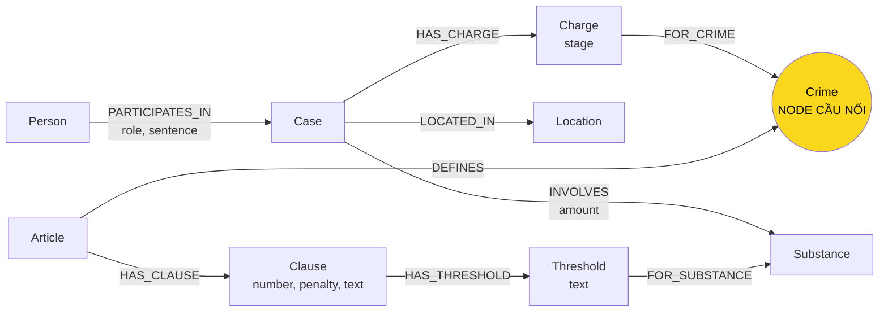

# Thiết kế Ontology — Day 19

**Họ tên:** …  **MSSV:** …

**Lựa chọn:**
- [ ] Dùng ontology gợi ý
- [x] Tự thiết kế (xét bonus +15)

Thiết kế này khác ontology gợi ý ở hai điểm có chủ đích: thêm `Charge` để mô hình
hóa một sự kiện cáo buộc theo từng vụ, và thêm `Threshold` để mô hình hóa ngưỡng
khối lượng theo chất thay vì chỉ để trong văn bản khoản luật.

## 1. Sơ đồ

**Thứ xuất hiện trong KB:**

- KB luật: `Article`, `Clause`, `Crime`, `Substance`, `Threshold`, khối lượng và
  khung hình phạt.
- KB tin tức: `Person`, `Case`, `Charge`, `Crime`, `Substance`, `Location`, vai
  trò và mức án.
- Có ở cả hai KB: `Crime` và `Substance`. `Crime` là cầu nối chính; `Substance`
  giúp đối chiếu chất và ngưỡng giữa tin tức với khoản luật.

## 2. Entity types

| Label | Ý nghĩa | Khóa `MERGE` | Properties | KB | Trích xuất |
| --- | --- | --- | --- | --- | --- |
| `Article` | Một điều luật | `id` | `id`, `title`, `law`, `doc_id` | Luật | Regex + metadata |
| `Clause` | Một khoản trong điều | `id` | `id`, `number`, `penalty`, `text`, `doc_id` | Luật | Regex |
| `Threshold` | Ngưỡng của một khoản đối với một chất | `clause_id|substance` | `id`, `text`, `clause_number`, `doc_id` | Luật | Regex + giữ nguyên text |
| `Crime` | Tội danh chuẩn | `name` chuẩn hóa | `name` | Cả hai | Regex/LLM + `link_entity` |
| `Substance` | Chất ma túy chuẩn hóa | `name` | `name` | Cả hai | Regex luật, LLM tin |
| `Case` | Vụ án/vụ việc trong tin | `name` | `name`, `summary`, `date`, `doc_id` | Tin | LLM |
| `Charge` | Cáo buộc của một vụ | `doc_id|case|crime` | `id`, `stage`, `doc_id` | Tin | LLM + `link_entity` |
| `Person` | Bị cáo/bị can/người liên quan | `name` | `name`, `aliases`, `doc_id` | Tin | LLM |
| `Location` | Địa điểm vụ việc | `name` | `name`, `doc_id` | Tin | LLM |

`Crime`, `Substance`, `Person` và `Location` được dùng chung theo tên chuẩn.
Các node sinh từ tài liệu vẫn lưu `doc_id` để truy xuất ngược sang chunk vector.

## 3. Relationships

| Type | Từ → Đến | Properties | Ý nghĩa |
| --- | --- | --- | --- |
| `DEFINES` | `Article` → `Crime` | — | Điều luật định nghĩa tội danh |
| `HAS_CLAUSE` | `Article` → `Clause` | — | Điều gồm khoản nào |
| `HAS_THRESHOLD` | `Clause` → `Threshold` | — | Khoản có ngưỡng nào |
| `FOR_SUBSTANCE` | `Threshold` → `Substance` | — | Ngưỡng áp dụng cho chất nào |
| `HAS_CHARGE` | `Case` → `Charge` | — | Vụ có cáo buộc nào |
| `FOR_CRIME` | `Charge` → `Crime` | — | Cáo buộc trỏ tới tội danh |
| `INVOLVES` | `Case` → `Substance` | `amount` | Vụ liên quan chất/khối lượng |
| `LOCATED_IN` | `Case` → `Location` | — | Địa điểm vụ việc |
| `PARTICIPATES_IN` | `Person` → `Case` | `role`, `sentence`, `charge` | Người tham gia vụ và vai trò |

## 4. Node cầu nối

- **Node:** `Crime`.
- **Lý do:** tin tức nêu tội danh của vụ án, còn luật định nghĩa tội danh và khung
  hình phạt. `Charge` giữ ngữ cảnh vụ án; `Crime` là khóa ngữ nghĩa dùng chung để
  đi sang `Article` và `Clause`.
- **Khớp tên:** lấy danh sách tội danh từ tiêu đề luật; chuẩn hóa chữ thường,
  khoảng trắng và tiền tố `tội` bằng `normalize_crime`; dùng fuzzy match cutoff
  0.8 qua `link_entity`, luôn trả spelling chuẩn từ danh sách luật.
- **Cầu gãy:** LLM có thể trả tội danh không có trong luật hoặc khác quá xa.
  `link_entity` trả `None` và không tạo liên kết đoán mò; cần kiểm tra prompt,
  alias hoặc bổ sung luật tương ứng rồi dựng lại graph.

## 5. Competency questions

| Câu | Đường đi Cypher | Trả lời được? |
| --- | --- | --- |
| Q1 | `(:Article {id:'Điều 2 Luật PCMT'})-[:HAS_CLAUSE]->(:Clause {number:4})`; lấy `Clause.text` chứa “Tiền chất”. | Có |
| Q2 | `(:Person)-[r:PARTICIPATES_IN]->(:Case)-[:HAS_CHARGE]->(:Charge)-[:FOR_CRIME]->(:Crime)`; lọc `r.sentence` chứa “tử hình”. | Có |
| Q3 | `Person-[:PARTICIPATES_IN]->Case-[:HAS_CHARGE]->Charge-[:FOR_CRIME]->Crime<-[:DEFINES]-Article 251-[:HAS_CLAUSE]->Clause 1`; lấy sentence, crime, penalty. | Có |
| Q4 | `Person {name:'Dương Minh Tuấn'}-[:PARTICIPATES_IN]->Case-[:HAS_CHARGE]->Charge-[:FOR_CRIME]->Crime<-[:DEFINES]-Article 255-[:HAS_CLAUSE]->Clause`; alias `Hoàng Nato` dùng để tìm Person. | Có |
| Q5 | `Person Cái Quang Huy-[:PARTICIPATES_IN]->Case-[:HAS_CHARGE]->Charge-[:FOR_CRIME]->Crime<-[:DEFINES]-Article 250`; đồng thời `Case-[:INVOLVES]->MDMA` và `Article-[:HAS_CLAUSE]->Clause-[:HAS_THRESHOLD]->Threshold-[:FOR_SUBSTANCE]->MDMA`. | Có |
| Q6 | `Case-[:INVOLVES]->Substance {name:'MDMA'}` rồi nối ngược `Person-[:PARTICIPATES_IN]->Case`; dùng `DISTINCT` theo Case. | Có |

Q1 lấy khoản 4 Điều 2 Luật PCMT, Q3/Q4/Q5 là truy vấn xuyên KB, còn Q6 là
truy vấn tổng hợp tin tức.

## 6. Quyết định thiết kế và đánh đổi

1. **Tách `Charge` khỏi `Crime`:** ontology gợi ý nối trực tiếp Case–Crime. Node
   mới lưu `stage='charged'` và khóa theo vụ/tài liệu, không làm mất ngữ cảnh khi
   một tội danh xuất hiện trong nhiều vụ.
2. **Tách `Threshold`:** ontology gợi ý chỉ lưu ngưỡng trong `Clause.text`. Node
   mới nối ngưỡng với đúng chất, thuận tiện cho truy vấn định lượng; hiện vẫn giữ
   text gốc để tránh mất thông tin.
3. **Dùng regex cho luật và LLM cho tin:** luật có cấu trúc ổn định, còn tin có
   văn xuôi tự do về người, vai trò và vụ án.
4. **Chuẩn hóa Crime/Substance:** `MERGE` theo tên chuẩn tránh node trùng, nhưng
   tên lóng chưa có trong danh sách vẫn có thể bị bỏ sót.
5. **Thuộc tính vai trò trên cạnh:** một người có thể có vai trò/mức án khác nhau
   trong các vụ khác nhau, nên không đặt các thuộc tính này trên Person.

## 7. So với ontology gợi ý

| Khác biệt | Gợi ý | Thiết kế này | Vấn đề giải quyết | Bằng chứng |
| --- | --- | --- | --- | --- |
| Cáo buộc | `Case-CHARGED_WITH->Crime` | `Case-HAS_CHARGE->Charge-FOR_CRIME->Crime` | Lưu stage và khóa cáo buộc theo vụ | `MATCH (k:Case)-[:HAS_CHARGE]->(ch:Charge)-[:FOR_CRIME]->(c:Crime) RETURN ch.stage,c.name` |
| Ngưỡng | Chỉ trong `Clause.text` | `Clause-HAS_THRESHOLD->Threshold-FOR_SUBSTANCE->Substance` | Truy vấn ngưỡng theo chất | `MATCH (cl:Clause)-[:HAS_THRESHOLD]->(t:Threshold)-[:FOR_SUBSTANCE]->(s) RETURN s.name,t.text` |
| Người–vụ | `INVOLVED_IN` | `PARTICIPATES_IN`, charge tách riêng | Tách vai trò tham gia khỏi cáo buộc | `MATCH (p:Person)-[r:PARTICIPATES_IN]->(k:Case) RETURN p.name,r.role` |

Đây là các thay đổi cấu trúc và đã được triển khai trong `src/graph.py`, không
chỉ đổi tên label.

## 8. Hạn chế còn lại

- `Case.name` do LLM đặt nên cùng một vụ ở hai bài có thể thành hai node.
- `Person.name` và alias chưa xử lý hết viết tắt, lỗi chính tả và người trùng tên.
- `Threshold.text` chưa có `min_value`/`max_value` dạng số; so sánh định lượng
  hoàn toàn trong Cypher vẫn cần bổ sung parser.
- `Charge.stage` hiện mặc định là `charged`; chưa tách đầy đủ bắt, khởi tố,
  truy tố, xét xử sơ thẩm và phúc thẩm.
